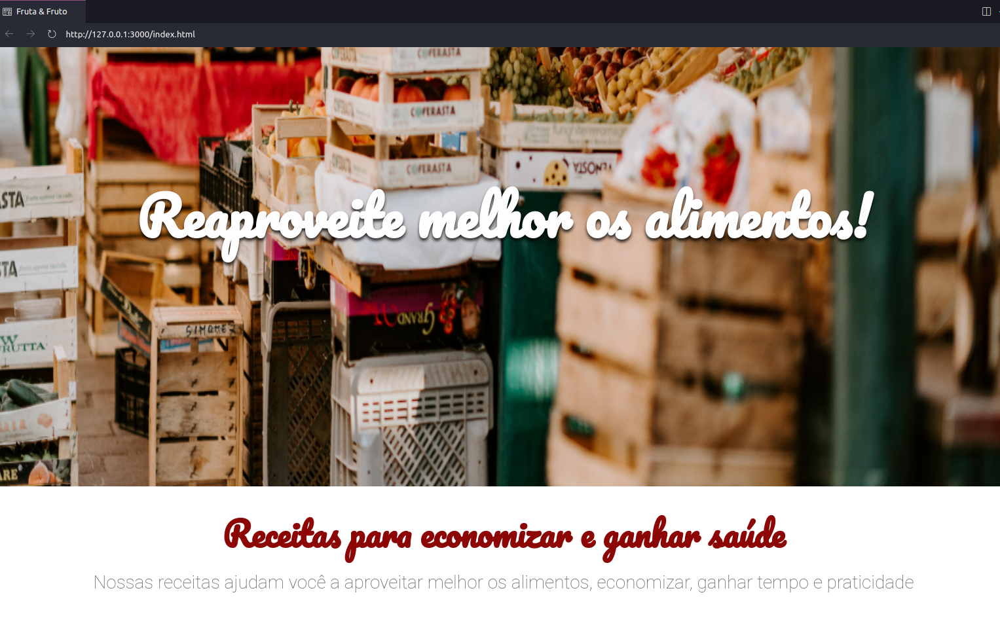

# arquitetura-css
curso de arquitetura da Alura. 

**Faça esse curso de HTML e CSS e:**

- Simplifique a organização de seus arquivos CSS.

- Crie arquiteturas CSS simples e robusta.

- Aprenda boas práticas e metodologias sobre CSS.

- Deixe o seu site responsivo.

GitHub Pages: 
[Acessem](https://tiagomerc.github.io/Arquitetura-CSS-descomplicando-os-problemas/)

### 01. Layout base e Estilização de cabeçalho

Nessa aula, aprendemos:

- a utilizar seletores CSS mais simples;

- a organizar a estruturar os arquivos css do projeto;

- Metodologia Atomic Design.

**Estilização cabeçalho**

### 02. Estilização de Banner e Sobre 

**Estilização de banner**

Nessa aula, aprendemos:

- Um padrão para nomear as classes de CSS;

- Conhecemos a metodologia BEM.

### 03. Estilização das Receitas

**Estilização receitas**

Nessa aula, aprendemos:

- Organização e estrutura de arquivos .css;

- Separação de responsabilidades;

- a criar e manter arquivos menores.

### 04. EStilização do Quem Somos

Nessa aula, aprendemos:

- Imagens ilustrativas devem estar referenciadas em nossos arquivos .css

- Boas práticas com importação de imagens;

- A manter as estilizações nos arquivos de estilo.

**Estilizando imagens**

**Boas práticas com imagens**

### 05. Estilização do rodapé e Responsividade

Nessa aula, aprendemos:

-Tornar um site responsivo;

- Como configurar a adaptação do site a diferentes tamanhos de tela.

- Nesse link você encontra o projeto completo com todas as aulas

**Responsividade**

_____

_________

